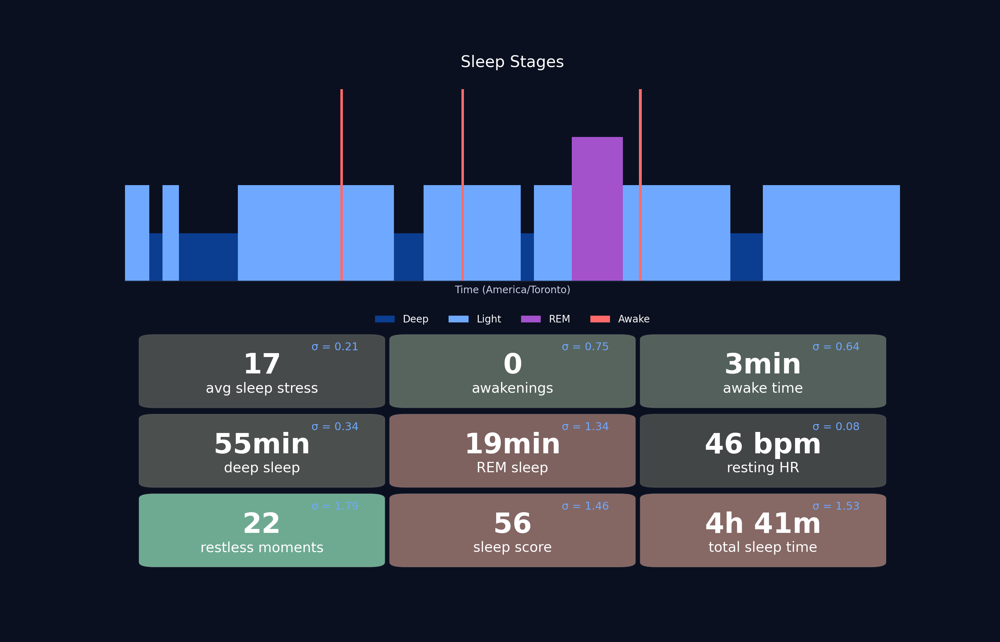
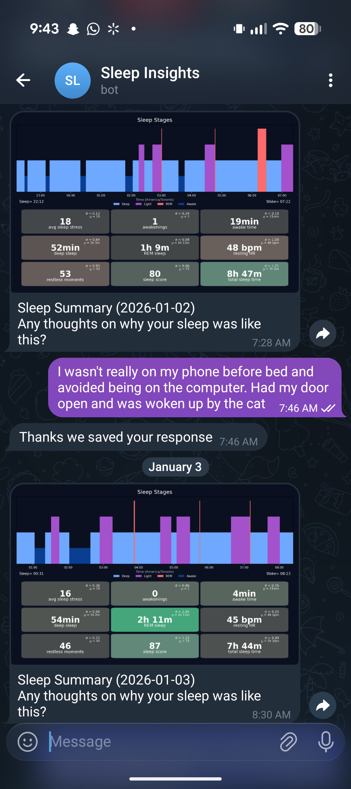

# Garmin-Sleep-Check-Ins Overview
This is an add on to the the garmin-grafana prject created by @arpanghosh8453 that provides sleep insight messages to you from your locally hosted database.

This utlizes the existing Influx database as part of the garmin-grafana project

It reads from the database looking for new sleep files after they are downloaded from your garmin account.

When it find one, it generates either a text or image based summary based on that day's sleep data and comparing it to the past. 

It then messages you through Telegram with the summary and you why the sleep was that way.

When you reply, it stores your info back into the influx database as a sleepJournal measure and acknowledges it has been saved.

There are demo functions that don't require connecting a garmin account or telegram. As well as ways to export all your data and delete all of your sleepJournal entries see the more detailed explenation of the one shot functions below.

##################
#QUICKSTART GUIDE:
##################
1) Install docker, already required for garmin-grafana

2) Ensure garmin-grafana is running and linked to your garmin account and there is data contained within the Influx database

3) You will need to a device with telegram to create a chat for this to communicate with, on the device setup a bot chat (see below Setting up Telegram Bot section below).

4) Change the file name of the .env.example to .env so that your docker container will know to use it and input the required telegram chat variables.

5) Run the "rebuild.sh" bash script from within the repo folder. 

You are done, you should get an initial message for the day and as new sleeps are uploaded to garmin connect and appear in your influx database you will get a message. Note there may be a delay for the first appearing in the garmin-grafana database (default 5min) and then for the polling for a message to be sent (default 10min). 

#########################
#Setting up Telegram Bot:
#########################

Download telegram 

In the search look for BotFather make sure you choose the one with the checkmark

message "/start"

message "/newbot"

message a name for the bot this is what is going to show up as the name on the chat

message a username this needs to be unique and you won't really need it for anything

Once created read the message it will tell you the TELEGRAM_BOT_TOKEN

Send the bot a message any message.

Then in a web browswer navigate to putting in your bot token from the previous step:
https://api.telegram.org/bot<TELEGRAM_BOT_TOKEN>/getUpdates

Please note the JSON message won't appear if you are already running the telegram-listener service so you will need to stop the container

##############
#How it works:
##############

There are two persistant containers one for polling the InfluxDatabase looking for new sleep data. And one to do longPolling of the telegram chat looking for new sleepJournal messages that need to be saved in the database. Both of these containers "sleep-checkins-scheduler" and "telegram-listener" must be running to be able to properly send messages and have them saved to the chat.

The "sleep-checkins" container is for running one-shot functions that don't need to be persistently running.

#####################
#One Shot Functions:
#####################

To run one of the standalone python programs us the helper bash script run_standalone.sh This will allow you to select which function you want to run i.e.) demo.py, delete_sleep_journal_entries.py, sleep_data_export.py

Run demo.py - To see a demo of this on generic sleep data and the insight it would generate and the type of question it would ask you. Try out the demo.py. Note this is just for demo purposes it uses the command line not telegram and your influx db will not be updated with your insight/response.

Run sleep_data_export.py - To export your data including your sleep journal entries in .csv files and .jsonl files use the sleep_data_export.py

Run delete_sleep_journal_entries.py - If you want to get rid of all of your sleepJournal measures in the database use the delete_sleep_journal_entries.py

#################
#Known Limitations
##################

64 bit architecture is required for running this. 32 bit architecture fails to load the docker images.

This has been tested on Linux Ubuntu. It is expected that outside of linux the time zone import into the container will fail resulting in the non-local time to fail.

